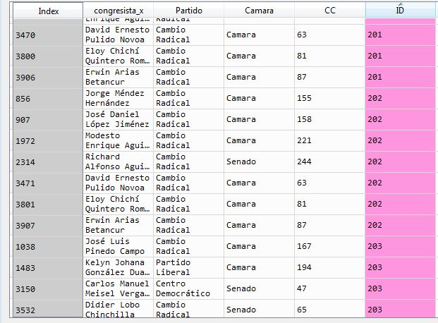

# Proyectos de Ley Presentados a la fecha por el actual Congreso de Colombia (julio 2018 - Mayo 2019)
__________________

### Contacto: 
Daniel Cifuentes Grueso 
Politólogo - Universidad del Rosario 
Candidato a Magister en Economía de las Políticas Públicas - Universidad del Rosario

daniel.cifuentes@urosario.edu.co
daniel.cifuentes77@gmail.com

## Descripción y Motivación 

El 20 de Julio de 2018 tomó posesión el vigente Congreso de la República de Colombia, quedando conformado por un total de 280 parlamentarios
, divididos en 102 senadores y 166 representantes a la Cámara. Desde entonces, congresistas, bancadas y coaliciones han desarrollado 
numerosos Proyectos de Ley en aras de cumplir su labor legislativa. 

Para conocer con mayor detalle  y poder analizar el desarrollo de la actividad legislativa vigente,  en este proyecto se extrajo la información 
relevante de los 625 Proyectos de Ley presentados a la fecha por Senadores y Representantes del Congreso de la República.

Así, se realizó web Scrape a las páginas web del Senado de la República, Cámara de Representantes y el portal Congreso Visible. 

 
Algunas preguntas que motivaron la investigación fueron: 
- ¿Cuántos Proyectos de Ley se han presentado a la fecha en el Congreso?

- ¿Qué bancadas y congresistas proponen más y menos Proyectos?

- En unas elecciones caracterizadas por el retorno del uribismo en el ejecutivo, y una fuerte presencia parlamentaria de dicho partido, es preciso 
identificar qué temas han sido principalmente abordados por el congreso, lo que permita identificar tanto los tópicos más relevantes como ignorados por los congresistas.

- ¿Cuáles son los temas más relevantes según sus proyectos de ley propuestos para destacados congresistas como Álvaro Uribe, Gustavo Petro, Antanas Mockus, 
Jorge Enrique Robledo, Roy Barreras, entre otros?  ¿se corresponde su discurso con sus proyectos? 

- ¿Cuál es el estado general de los Proyectos de Ley? ¿cuántos han avanzado? Estadísticamente ¿qué porcentaje de trámite hay en los proyectos de ley en su desarrollo? 

### Métodos Empleados 

Para ver el código empleado en su totalidad, click acá [Código Total](Spyder_Code_Proyecto_Final.py)

1. Web Scraping 
2. Pandas – Spyder 
3. Tableau 

1) Scraping:

Con el fin de construir bases de datos sólidos y con información coherente, la información se extrajo a partir de tres fuentes: 
- Portal Congreso Visible: 
De este portal se extrajo la mayor parte de información de los 625 proyectos de ley presentados a la fecha. Datos como: título del proyecto, estado, fecha de radicación, autores, resumen, palabras clave, Tema de cada proyecto y  Tags. 
Para ver el código empleado sobre esta página web click aquí [Código Scrap Congreso Visible](Scrape%20Congreso%20Visible%20.ipynb)

- Página web de la Cámara de Representantes 
Información de los Representantes: lista de nombres, partido, circunscripción, número de votos. 
Para ver el código empleado sobre esta página web click aquí [Código Scrap Cámara de Representantes](Scrape%20Página%20Camara%20de%20Representantes%20.ipynb)

- Página Web del Senado de la República 
Información de cada Senador: nombre completo, partido
Para ver el código empleado sobre esta página web click aquí[código Scrap Senado República](Scrape%20Página%20Senado%20de%20la%20República%20.ipynb)

### proceso

Dado que el portal ‘Congreso Visible’ funciona con JavaScript, fue preciso el uso de la Librería Selenium, a través del Driver Chrome.  Con esta librería fue posible consolidar una lista con las url de los 650 proyectos de ley.

Una vez se tuvo la lista de url´s, aplicando la librería Request, BeatufulSoup y Expresiones regulares se pudo extraer toda la información relevante de cada uno de los proyectos de ley. 

El algoritmo de extracción se calibró con el fin de capturar todas las posibles diferencias entre la redacción y ortografía de la página web. 

El resultado de aplicar el algoritmo fue una macro base de datos, compuesta por listas y cadenas dependiendo de la variable 

 

Dada la Macro Base de Datos, se emplearon métodos de str, diccionarios y Pandas para extraer los elementos contenidos en listas de la base de datos macro  y así posteriormente construir las bases de datos necesarias para el análisis. 

No obstante, si bien la página de Congreso Visible mostraba el partido de los autores, al momento de sistematizar la información, se encontraron grandes discrepancias, las cuales, de mantenerse, habrían sesgado completamente el posterior análisis. Por tal razón, fue preciso extraer la información de cada congresista desde la página web del senado y cámara, para posteriormente vincularla con la base de datos. En este punto, igualmente se emplearon herramientas de web scrape, Regex y pandas. 

,

#### Organización de las Bases de datos

Con el fin de estructurar la información en bases de datos que permitieran un óptimo análisis Se emplearon herramientas de Pandas a través del IDE Spyder, con el fin de limpiar, organizar y fusionar las distintas variables. 

Finalmente, se consolidaron cuatro bases de datos cuya llave fundamental fue un ID asignado a cada proyecto de ley

Así mismo, se asigno un código de referencia único para cada congresista, lo que permitió articular la información extraída de las tres fuentes mencionadas. 
Bases de datos: 

Para ver el código que organiza y crea las 4 bases de datos click aquí [Código Bases de Datos](Consolidación%20de%20las%204%20Bases%20de%20Datos%20.ipynb)

1. Base con Elementos de una sola variable:  [Ver archivo CSV de la Base de datos](Base_datos_unicos.csv)  

2. Base relacionando cada proyecto de ley con sus autores, partidos y cámara a que pertenecen: [Ver archivo CSV de la Base de datos](BASE_2.csv)

3. Base que relaciona cada proyecto de ley con sus  temas:  [Ver archivo CSV de la Base de datos](Base_Temas.csv)

4. Base que relaciona cada proyecto de ley con sus sub temas o Tags   [Ver archivo CSV de la Base de datos](Base_Tags.csv)

#### Análisis de Datos 

Una vez se comprobó que todas las bases de datos funcionaran correctamente, y libres de errores, se exportaron en formato CSV y posteriormente se cargaron en el software de análisis de datos Tableau. 

## Hallazgos 

Dada la consolidación de la base de datos, fue posible responder todas las preguntas inicialmente planteadas, así como encontrar relaciones y correlaciones llamativas entre congresistas, partidos y coaliciones. 

así mismo, fue posible ver gráficamente el comportamiento de los partidos de acuerdo a sus propuestas legislativas y discriminar dichos resultados por cámara. 

